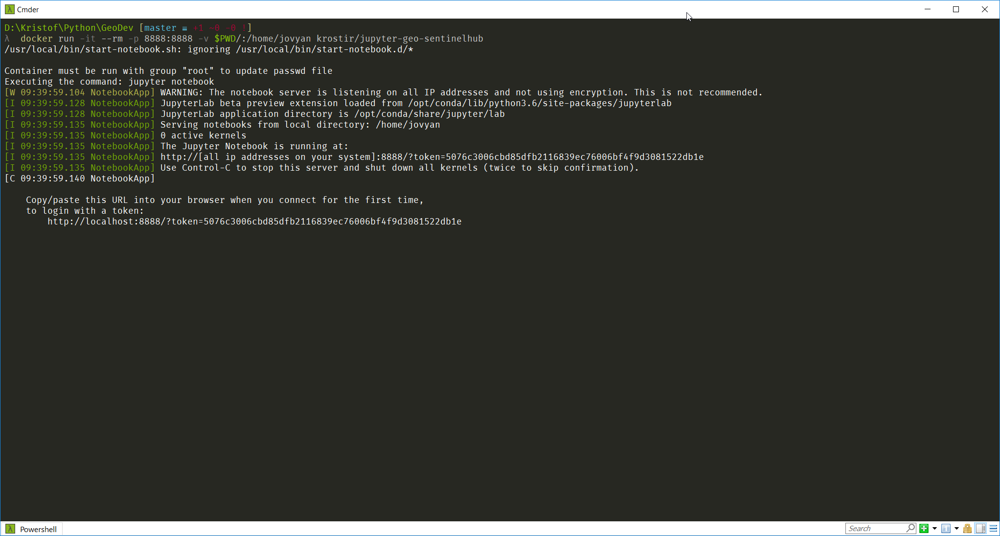
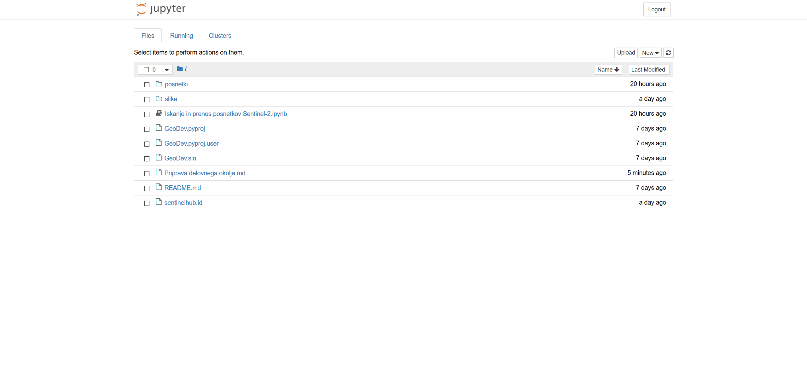
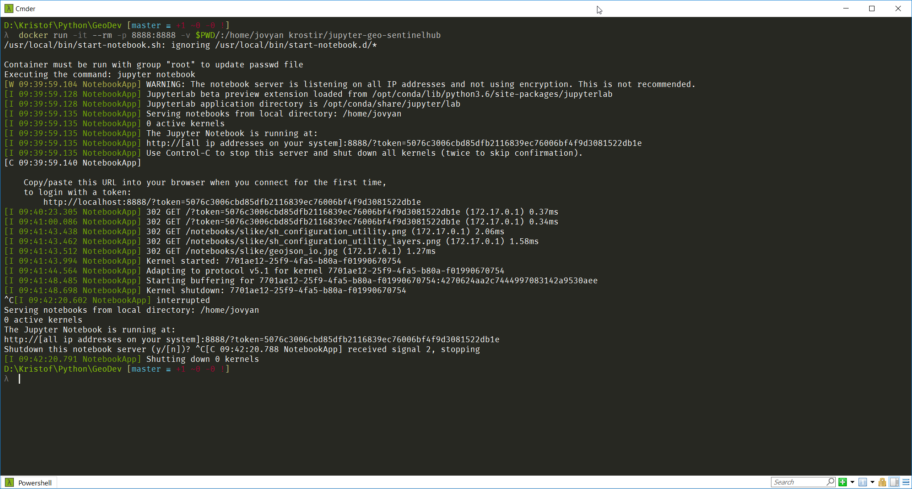

# Priprava delovnega okolja

Delo bo potekalo na ustrezno opremljenih računalnikih v računalniški učilnici [UL FGG](https://www.fgg.uni-lj.si/).

Postopek je mogoče izvesti na kateremkoli računalniku, ki ima nameščen in konfiguriran [Docker](https://www.docker.com). Predlagam prenos [Docker Community Edition](https://www.docker.com/community-edition), ki je brezplačna.

Za GeoDev je pripravljena Docker slika, ki vsebuje potrebne knjižnice za delo s satelitskimi posnetki prek Sentinel Huba. Slika vsebuje kompleten [Jupyter Notebook Scientific Python Stack](https://github.com/jupyter/docker-stacks/tree/master/scipy-notebook), dodatno pa še [GDAL](http://www.gdal.org/), [rasterio](https://mapbox.github.io/rasterio/) in [Sentinel Hub](https://github.com/sentinel-hub/sentinelhub-py).

Slika je na voljo na Docker Hubu:  
https://hub.docker.com/r/krostir/jupyter-geo-sentinelhub/

Če je Docker pravilno nameščen, jo lahko prenesemo prek terminala (PowerShell, Terminal, iTerm, ...) z ukazom:
```bash
docker pull krostir/jupyter-geo-sentinelhub
```

Poženemo Docker zabojnik, v katerem je Jupyter strežnik:
```bash
docker run -it --rm -p 8888:8888 -v $PWD/:/home/jovyan krostir/jupyter-geo-sentinelhub
```

Strežnik je konfiguriran tako, da podatke shranjuje v mapo iz katere je bil pognan. Zato se je v terminalu potrebno predhodno premakniti v pravo mapo (uporabnik mora imeti dovoljenje za pisanje).



Po uspešnem zagonu v terminalu izpisani naslov, praviloma `http://localhost:8888/?token=***` vnesemo v brskalnik. Vse delo bo potekalo preko Jupyter beležnic v brskalniku.



Ko zaključimo delo in shranimo ter zaustavimo vse beležnice, strežnik zaustavimo v terminalu s kombinacijo `Ctrl-C`.


